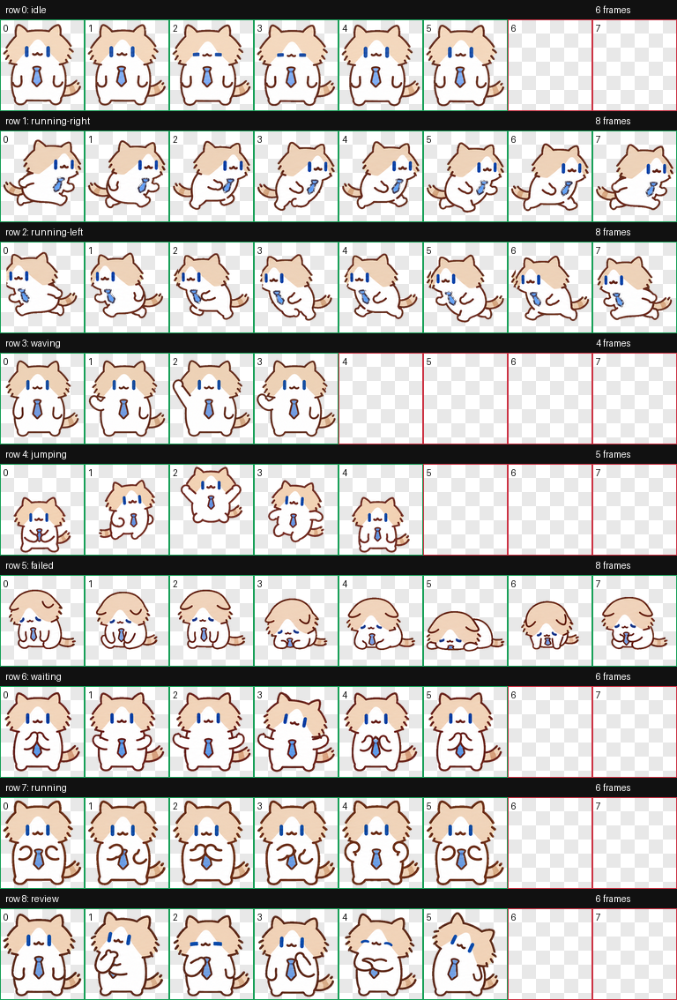

# 月薪喵：Codex Pet + Production Skill

这个仓库分享两样东西：

1. 手搓的 Codex 动画宠物「月薪喵」；
2. 用来生产、质检和安装类似宠物的 `codex-pet-production` Skill。



## 1. 安装月薪喵

仓库中的成品宠物位于：

```text
pets/yuexin-miao/
├── pet.json
├── spritesheet.webp
├── contact-sheet.png
└── previews/*.gif
```

克隆仓库后，将宠物包复制到 Codex：

```bash
mkdir -p ~/.codex/pets/yuexin-miao
cp pets/yuexin-miao/pet.json ~/.codex/pets/yuexin-miao/
cp pets/yuexin-miao/spritesheet.webp ~/.codex/pets/yuexin-miao/
```

然后进入 Codex 的 Settings → Pets，点击 Refresh，选择「月薪喵」。

## 月薪喵的动作状态

| 行 | 状态 | 帧数 | 用途 |
| ---: | --- | ---: | --- |
| 0 | idle | 6 | 待机、呼吸和眨眼 |
| 1 | running-right | 8 | 向右拖动 |
| 2 | running-left | 8 | 向左拖动 |
| 3 | waving | 4 | 挥手 |
| 4 | jumping | 5 | 跳跃 |
| 5 | failed | 8 | 任务失败或被阻塞 |
| 6 | waiting | 6 | 等待用户输入或确认 |
| 7 | running | 6 | 任务处理中 |
| 8 | review | 6 | 查看与检查结果 |

单行动画预览位于 [`pets/yuexin-miao/previews`](pets/yuexin-miao/previews)。

## 2. 安装宠物生产 Skill

`SKILL.md`、模板和生产指南位于仓库根目录。可以直接把整个仓库作为个人 Skill 安装：

```bash
git clone https://github.com/frank-1150/codex-yuexin-miao.git \
  ~/.codex/skills/codex-pet-production
```

如果只想复制技能文件，请保留以下结构：

```text
SKILL.md
agents/openai.yaml
assets/
references/
```

重新启动 Codex 或新建任务后，可以这样调用：

```text
Use $codex-pet-production to turn my character references and pet brief into a validated and installed Codex pet.
```

中文完整指南：[docs/guide.zh-CN.md](docs/guide.zh-CN.md)

## Skill 解决什么问题

它把以下流程标准化：

```text
用户输入
  -> 角色主形象
  -> 九行动画
  -> 绿幕透明化
  -> 固定精灵图集
  -> 确定性验证
  -> GIF 视觉质检
  -> Codex 宠物安装包
```

核心加速策略是 `base → idle → running-right` 三步质量闸门。只有角色身份、待机动画和方向步态通过后，才并行生成剩余动作，从而避免一次生成九行后整体返工。

## Codex 宠物格式

- 图集：透明 PNG 或 WebP，`1536x1872`
- 网格：8 列 × 9 行
- 单格：`192x208`
- 未使用单元格：完全透明
- 安装包：

```text
~/.codex/pets/<pet_id>/
├── pet.json
└── spritesheet.webp
```

## 仓库结构

```text
.
├── pets/yuexin-miao/          # 可直接安装的月薪喵
├── SKILL.md                    # Codex Skill 主入口
├── agents/openai.yaml          # Skill UI 元数据
├── assets/                     # 用户输入和工作者提示词模板
├── references/                 # 生产流程与 QA 修复矩阵
├── docs/guide.zh-CN.md         # 中文标准作业指南
└── examples/pet-brief.yaml     # 无本机路径的示例输入
```

## 依赖

这个 Skill 负责编排和质量控制，并复用 Codex 中的系统 `imagegen` Skill 与 curated `hatch-pet` Skill。仓库不复制后者的图像处理实现，以避免版本分叉。

## 隐私与素材

- 仓库不包含原始网络表情包。
- 仓库不包含用户本机路径、生成缓存、账号信息或凭据。
- 只包含最终「月薪喵」宠物包、动作预览和通用生产 Skill。

## License

代码、Skill 指令、模板和文档采用 MIT License。角色与生成图像的使用说明见 [NOTICE.md](NOTICE.md)。
